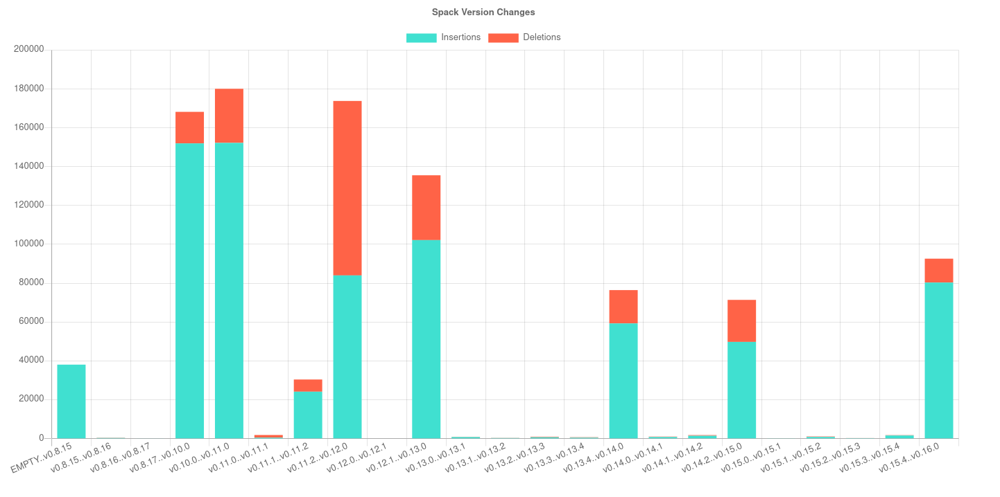

Caliper is a tool for measuring and assessing change in packages.

See the [documentation](https://caliper-python.readthedocs.io/en/latest/) for getting started.

## TODO

- write tests to discover and test all metrics (type, name, etc.)
- think of common functions to run metric
- create visualization of grid of errors / scripts, and mouesover to see codes (server rendered)
- stats: try to estimate types of codes (e.g., error name)

### Analysis Ideas

1. Start with a bunch of unit tests for a library (or example scripts) and build a model that can predict success (return code 0) vs fail (any other code) based on the scripts (tokens is a simple idea). Then given a new script without declared versions, predict which will work.
2. (A slightly different project) - given a set of known "optimal" containers for a library like tensorflow, parse dependencies, versions, and library versions, run across same set of unit tests / example scripts, and try to say which combos (architecture and dependencies) works for different kinds of scripts.

## License

 * Free software: MPL 2.0 License
