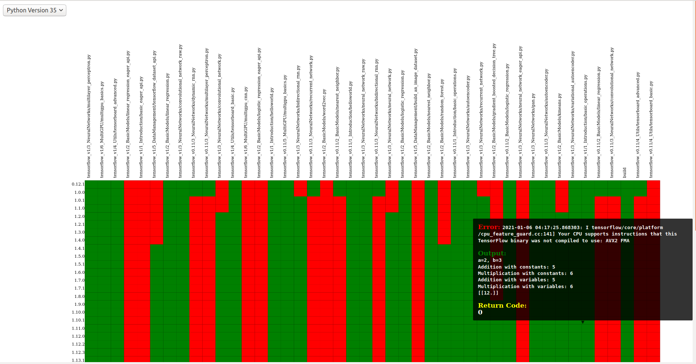

.. _getting_started-user-guide:

==========
User Guide
==========

Caliper is a tool for measuring and assessing change in packages. It's currently
of interest if you want to study how developers create software, or some kind
of change that might predict something breaking. It might eventually be useful
as a tool to, given a script with dependencies specified, know the kind of flexibility
you have to honor those dependencies (or not). This could be hugely useful for package
managers and solvers that need to try more flexible constraints given a conflict.

Concepts
========

 - **Manager**: a handle to interact with a package manager
 - **Extractor**: a controller to use a manager to extract metrics of interest
 - **Analysis**: A caliper analysis means attempting to build containers across versions of a library, and run against scripts for tests to assess functionality.
 - **Version repository**: a repository created by an extractor that tagged commits for package releases
 - **Metrics**: are a type of classes that can extract a single timepoint, or a change over time (e.g., lines changed). You can see example metrics that have been extracted under in the `vsoch/caliper-metrics <https://github.com/vsoch/caliper-metrics>`_

Managers
========

A manager is a handle to interact with a package, whether that be software or data.

Pypi
----

The first kind of package we are interested in is one from pypi.
We might quickly extract all metrics to an output folder from the command line for
a Pypi package:

.. code:: console

    caliper extract --outdir caliper-metrics/ pypi:sregistry

Pypi Details
^^^^^^^^^^^^

or we can instantiate a manager from Python, and walk through the steps
that the client takes. First we create the manager.

.. code:: python

    from caliper.managers import PypiManager
    manager = PypiManager("sregistry")

The manager specs include the source archive, version, and hash for each version
of the package. The schema of the spec is a subset of the spack package schema.
Every manager exposes this metadata.

.. code:: python

    manager.specs[0]
    Found 82 versions for sregistry
    {'name': 'sregistry',
     'version': '0.0.1',
     'source': {'filename': 'https://files.pythonhosted.org/packages/ef/2f/ccc36e816dc081abbe0932c422586eda868719025ec07ac206ed254d6a3c/sregistry-0.0.1.tar.gz',
      'type': 'source'},
     'hash': 'd4ee6933321b5a3da13e0b1657ca74f90477f670e59096a6a0a4dbb30a0b1f07'}

    manager.specs[-1]
    {'name': 'sregistry',
     'version': '0.2.36',
     'source': {'filename': 'https://files.pythonhosted.org/packages/75/6c/2b5bcf0191c0ddc9b95dd156d827c8d80fa8fe86f01f7a053fdd97eaea41/sregistry-0.2.36.tar.gz',
      'type': 'source'},
     'hash': '238ebd3ca0e0408e0be6780d45deca79583ce99aed05ac6981da7a2b375ae79e'}

If you just interact with `manager.specs`, you'll get a random architecture for each
one. This can be okay if you want to do static file analysis, but if you want to choose
a specific python version, your best bet is to call the get package metadata function
directly and provide your preferences. For example, here we want Tensorflow for Python 3.5
and a specific linux architecture:

.. code:: python

    manager.get_package_metadata(python_version="35", arch="manylinux1_x86_64")

To derive these search strings, you can look at examples of wheels provided.
This isn't the default because not all packages provide such rich choices.
Here is an example from an early version of tensorflow.

.. code:: console

    tensorflow-0.12.0-cp27-cp27m-macosx_10_11_x86_64.whl
    tensorflow-0.12.0-cp27-cp27mu-manylinux1_x86_64.whl
    tensorflow-0.12.0-cp34-cp34m-manylinux1_x86_64.whl
    tensorflow-0.12.0-cp35-cp35m-macosx_10_11_x86_64.whl
    tensorflow-0.12.0-cp35-cp35m-manylinux1_x86_64.whl
    tensorflow-0.12.0-cp35-cp35m-win_amd64.whl

For more recent versions you would see Python 3.8 and 3.9, and definitely not 2.x.
The above function still selects one release based on your preferences. You can also choose to return a subset of
_all_ versions with the filter function. For example, here let's narrow down the set
to include those that can be installed on Linux.

.. code:: python

    releases = manager.filter_releases('manylinux1_x86_64')

You can also get a set of unique Python versions across packages:

.. code:: python

    python_versions = manager.get_python_versions()
    # {'cp27', 'cp33', 'cp34', 'cp35', 'cp36', 'cp37', 'cp38'}

Not all package versions are guaranteed to have these Python versions, but that's
something interesting to consider. And you can always interact with the raw package metadata at `manager.metadata`.

GitHub
------

We might also be interested in releases from GitHub. Extracting
metrics from the command line would look like this:

.. code:: python

    caliper extract --outdir caliper-metrics/ github:vsoch/pull-request-action

GitHub Details
^^^^^^^^^^^^^^

And we could do the same steps as above (as we did with the [pypi manager](#pypi-manager)
to create an interactive manager client.

.. code:: python

    from caliper.managers import GitHubManager
    manager = GitHubManager("vsoch/pull-request-action")

GitManager
----------

A GitManager is a special kind of manager that exists to interact with a git repository.
It will be possible to use it as a manager proper (not yet developed) but it can also
serve to create and interact with local git repositories. For example, let's create
a temporary directory, add stuff to it, commit and then tag it.

.. code:: python

    from caliper.managers import GitManager
    import tempfile
    git = GitManager(tempfile.mkdtemp())
    git.init()

    # write some content (file.txt)

    git.add("file.txt")
    git.commit("Adding new content!")
    git.tag("tag")

Note that when you run ``git.init()`` a dummy username and email will be added
to the ``.git/config`` file so we can continue interactions without needing a global
setting. This is done intentionally based on the idea that the user likely won't keep
the version repository, however if you do want to keep it, feel free to change or
remote these settings in favor of global ones.

You can imagine how this might be used - we can have a class that can take a manager,
and then iterate over versions/releases and create a tagged commit for each.
We can then easily extract metrics about files changed between versions.
This is the metrics extractor discussed later.

Dataverse
---------

`Dataverse <https://dataverse.org/>`_ is a well known open source repository for datasets.
You'll need to install the extra dependency `pyDataverse <https://pypi.org/project/pyDataverse/>`_ to use it.
Either of the following will install it:

.. code:: console

    pip install caliper[dataverse]
    pip install pyDataverse

If you expect to be parsing Python 2 files, you'll want to install with jedi (or all):

.. code:: console

    pip install caliper[jedi]
    pip install caliper[all]

Before using the client, you can optionally specify the base url that you want to
use by exporting it to the environment. By default we use Harvard's Dataverse portal:

.. code:: console

    export CALIPER_DATAVERSE_BASEURL=https://dataverse.harvard.edu/

Once you have it installed, you can do an extraction for

.. code:: console

    caliper extract --outdir caliper-metrics/ dataverse:doi:10.7910/DVN/X1OVSU

Dataverse Details
^^^^^^^^^^^^^^^^^

We can also instantiate a manager from Python, and walk through the steps
that the client takes. First we create the manager.

.. code:: python

    from caliper.managers import DataverseManager
    manager = DataverseManager("doi:10.7910/DVN/X1OVSU")

Since the dataverse API only returns a result for the latest, our specs will
only include that one version.

.. code:: python

    manager.specs[0]
    {'name': 'doi:10.7910/DVN/X1OVSU',
     'version': '1',
     'source': {'files': [{'description': 'This file contains the two-parameter FIR SED templates introduced in Safarzadeh et al. (2016, http://adsabs.harvard.edu/abs/2015arXiv150900034S). The templates are parameterized in terms of the IR luminosity and dust mass. They were derived from mock SEDs of simulated isolated disk galaxies and galaxy mergers, which were generated by performing radiative transfer on hydrodynamical simulations in post-processing. See the file header for a complete description.',
        'label': 'Safarzadeh_et_al_2016_FIR_SED_templates.txt',
        'restricted': False,
        'version': 1,
        'datasetVersionId': 79010,
        'categories': ['Data'],
        'dataFile': {'id': 2753449,
         'persistentId': 'doi:10.7910/DVN/X1OVSU/0GEIAG',
         'pidURL': 'https://doi.org/10.7910/DVN/X1OVSU/0GEIAG',
         'filename': 'Safarzadeh_et_al_2016_FIR_SED_templates.txt',
         'contentType': 'text/plain',
         'filesize': 66966,
         'description': 'This file contains the two-parameter FIR SED templates introduced in Safarzadeh et al. (2016, http://adsabs.harvard.edu/abs/2015arXiv150900034S). The templates are parameterized in terms of the IR luminosity and dust mass. They were derived from mock SEDs of simulated isolated disk galaxies and galaxy mergers, which were generated by performing radiative transfer on hydrodynamical simulations in post-processing. See the file header for a complete description.',
         'storageIdentifier': 's3://dvn-cloud:151c7465f7b-91966fd5bb0a',
         'rootDataFileId': -1,
         'md5': 'df6d6d3add9fcd5c4a0eda488e6e564a',
         'checksum': {'type': 'MD5', 'value': 'df6d6d3add9fcd5c4a0eda488e6e564a'},
         'creationDate': '2015-12-21'}},
       {'description': 'Helper Python functions to facilitate use of the templates.',
        'label': 'template_functions.py',
        'restricted': False,
        'version': 1,
        'datasetVersionId': 79010,
        'categories': ['Code'],
        'dataFile': {'id': 2753450,
         'persistentId': 'doi:10.7910/DVN/X1OVSU/R7IGNE',
         'pidURL': 'https://doi.org/10.7910/DVN/X1OVSU/R7IGNE',
         'filename': 'template_functions.py',
         'contentType': 'text/x-python-script',
         'filesize': 5464,
         'description': 'Helper Python functions to facilitate use of the templates.',
         'storageIdentifier': 's3://dvn-cloud:151c7459a45-ee63a8abe99c',
         'rootDataFileId': -1,
         'md5': '33b65dbd06d1147c349e1496fd877142',
         'checksum': {'type': 'MD5', 'value': '33b65dbd06d1147c349e1496fd877142'},
         'creationDate': '2015-12-21'}}],
      'type': 'source'},
     'hash': 'DVN/X1OVSU'}

This also means that we cannot ask for a particular Python version or architecture.
Dataverse is only providing data files, and not releases according to these variables.

Caliper Analyze
===============

Caliper supports analyzing package functionality, which means that we take
a configuration file, a ``caliper.yaml``
with a package name, manager, Dockerfile template to build, and a list of tests.
We do this with the Caliper `analyze` command:

.. code:: console

    $ caliper analyze --help
    usage: caliper analyze [-h] [--config CONFIG] [--no-progress] [--serial] [--force] [--nprocs NPROCS]

    optional arguments:
      -h, --help       show this help message and exit
      --config CONFIG  A caliper.yaml file to use for the analysis (required)
      --no-progress    Do not show a progress bar (defaults to unset, showing progress)
      --serial         Run in serial instead of parallel
      --force          If an output file exists, force re-write (default will not overwrite)
      --nprocs NPROCS  Number of processes. Defaults to cpu count.

For example, we might use the example and do:

.. code:: console

    $ caliper analyze --config examples/analyze/caliper.yaml

to do a ``docker system prune --all`` after each build (recommended) add ``--cleanup``

.. code:: console

    $ caliper analyze --config examples/analyze/caliper.yaml --cleanup

And if your caliper.yaml is in the same folder as you are running caliper from, you
don't need to supply it (it will be auto-detected):

.. code:: console

    caliper analyze --cleanup

and run the builds in serial. A parallel argument is supported, but in practice
it doesn't work well building multiple containers at once.

Analyze Output
--------------

The output of analyze will be to write results to a ``.caliper`` folder, specifically
to ``.caliper/data``. The result files can then be parsed to generate an interactive
interface to explore them. A script is provided in the `examples/plot_analyze <https://github.com/vsoch/caliper/tree/main/examples/plot_analyze/>`_
folder of the repository, an example shown at `vsoch/caliper-analysis <https://vsoch.github.io/caliper-analysis/ground-truth/>`_,
and a screensht shown below.

caliper.yaml
------------

The caliper.yaml file is a small configuration file to run caliper. Currently, it's fairly simply
and we need to define the dependency to run tests over (e.g., tensorflow), the Dockerfile template,
a name, and then a list of runs:

.. code:: yaml

    analysis:
      name: Testing tensorflow
      packagemanager: pypi
      dockerfile: Dockerfile
      dependency: tensorflow
      versions:
        - 0.0.11
      python_versions:
        - cp27
      tests:
        - tensorflow_v0.11/5_MultiGPU/multigpu_basics.py
        - tensorflow_v0.11/1_Introduction/basic_operations.py
        - tensorflow_v0.11/1_Introduction/helloworld.py
        - tensorflow_v0.11/4_Utils/tensorboard_advanced.py

If you don't define a list of ``python_versions`` all will be used by default.
If you don't define a list of ``versions`` (e.g., versions of tensorflow) all versions
of the library will be tested. If you want to add custom arguments for your template (beyond a base image that
is derived for your Python software, and the dependency name to derive wheels to install)
you can do this with args:

.. code:: yaml

    analysis:
      name: Testing tensorflow
      packagemanager: pypi
      dockerfile: Dockerfile
      args:
         additionaldeps:
           - scikit-learn

The functionality of your arguments is up to you. In the example above, ``additionaldeps``
would be a list, so likely you would loop over it in your Dockerfile template (which uses jinja2).

Dockerfile
----------

The ``Dockerfile`` template (specified in the caliper.yaml) should expect
the following arguments from the caliper analysis script:

 - **base**: The base python image, derived from the wheel we need to install
 - **filename**: the url filename of the wheel to download with wget
 - **basename**: the basename of that to install with pip

Additional arguments under args will be handed to the template, and are up to you
to define and render appropriately.

Metrics Extractor
=================

Finally, a metrics extractor provides an easy interface to iterate over versions
of a package, and extract some kind of metric. There are two ways to go about it -
starting with a repository that already has tags of interest, or starting
with a manager that will be used to create it. For each, you have three options
for how to save data:

 - **json**: is a folder with a json file for each version. This is recommended for large repositories (e.g., tensorflow)
 - **json-single**: is a single json file of results, recommended for smaller repositories (e.g., sregistry)
 - **zip**: is an intermediate, a compression json file, recommended for large but not massive repositories.

You can specify the format with ``--fmt (json|json-single|zip)``.
The default is json, which is the most conservative to ensure small file sizes for GitHub.
It's recommended that you test extractions and choose the size that is right for you.
Whatever you choose, an ``index.json`` file is generated in the output metric folder
that will make it possible to detect what is available programmatically with a request.
We currently only support one extraction type at once, however if you think it necessary,
we can add support for multiple.

Metrics Available
-----------------

All caliper metrics available can be found in the `metrics/collection <https://github.com/vsoch/caliper/tree/main/caliper/metrics/collection>`_
folder in the caliper repository. Adding a new metric corresponds to creating a new folder here,
and then adding the metric to this list.

 - **functiondb**: is the function database metric. This means that for each version of a library we extract a lookup of all module functions, classes, and arguments. You might, for example, use this lookup to compare changes in the module over time.
 - **compspec**: a more formalized (structured) variant of a function database, intending to assess library compatibility.
 - **changedlines**: is exactly what it sounds like - we look _between_ versions and count the number of changed lined. Thus, this uses a ``ChangeMetricBase`` instead of a standard ``MetricBase``.
 - **totalcounts**: is also exactly what it sounds like! We look at each version and create a lookup that shows the total number of files for the metric. If other totals are wanted, we could add them here.

You can look at the `caliper-metrics <https://github.com/vsoch/caliper-metrics>`_ repository
to get a sense of the data. The changedlines metric is great for creating plots to show change in the module over time,
while the functiondb is great for assessing overall change to the module structure.

Extraction Using Client
-----------------------

When installed, caliper comes with an executable, ``caliper`` that can make it easy
to extract a version repository.

.. code:: console

    $ caliper --help
    usage: caliper [-h] [--version] {version,metrics,analyze,extract,view} ...

    Caliper is a tool for measuring and assessing changes in packages.

    optional arguments:
      -h, --help            show this help message and exit
      --version             suppress additional output.

    actions:
      actions

      {version,metrics,analyze,extract,view}
                            actions
        version             show software version
        metrics             see metrics available
        analyze             analyze functionality of a package.
        extract             extract one or more metrics for a software package.
        view                extract a metric and view a plot.

    LOGGING:
      --quiet               suppress logging.
      --verbose             verbose output for logging.
      --log-disable-color   Disable color for caliper logging.
      --log-use-threads     Force threads rather than processes.

The ``extract`` command allows to extract metrics for a package:

.. code:: console

    $ caliper extract --help
    usage: caliper extract [-h] [--metric METRIC] [-f {json,zip,json-single}] [--no-cleanup] [--outdir OUTDIR] [--force]
                           [packages [packages ...]]

    positional arguments:
      packages              package to extract, e.g., pypi:, github:

    optional arguments:
      -h, --help            show this help message and exit
      --metric METRIC       one or more metrics to extract (comma separated), defaults to all metrics
      -f {json,zip,json-single}, --fmt {json,zip,json-single}, --format {json,zip,json-single}
                            the format to extract. Defaults to json (multiple files).
      --no-cleanup          do not cleanup temporary extraction repositories.
      --outdir OUTDIR       output directory to write files (defaults to temporary directory)
      --force               if a file exists, do not overwrite.

But first we might want to see metrics available:

.. code:: console

    $ caliper metrics
         totalcounts: caliper.metrics.collection.totalcounts.metric.Totalcounts
          functiondb: caliper.metrics.collection.functiondb.metric.Functiondb
        changedlines: caliper.metrics.collection.changedlines.metric.Changedlines

Let's say we want to extract the changedlines metric for a pypi repository, sif, which
will return insertions, deletions, and overall change for each tagged release.
That would look like this:

.. code:: console

    $ caliper extract --metric changedlines pypi:sif
    Found 2 versions for sif
    Downloading and tagging 0.0.1, 1 of 2
    Downloading and tagging 0.0.11, 2 of 2
    Repository for [manager:pypi] is created at /tmp/sif-94zn1b6b
    Results will be written to /home/vanessa/Desktop/Code/caliper-metrics/pypi/sif

You can change the format by specifying ``--fmt``

.. code:: console

    $ caliper extract --metric changedlines --fmt zip pypi:sif
    $ caliper extract --metric changedlines --fmt json-single pypi:sif

By default, if you don't specify an output directory, the metrics will be saved
to the present working directory. The organization is by package type,
name, and then results files Here we can see results in all three
formats: ``zip``, ``json`` (multiple files), and ``json-single``:

.. code:: console

    $ tree
    └── pypi
        └── sif
            └── changedlines
                ├── changedlines-0.0.1..0.0.11.json
                ├── changedlines-EMPTY..0.0.1.json
                ├── changedlines-results.json-single
                ├── changedlines-results.zip
                └── index.json

And the index file makes it possible to see the contents of the folder (e.g.,
from a programmatic standpoint):

.. code:: json

    {
        "data": {
            "zip": {
                "url": "totalcounts-results.zip"
            },
            "json": {
                "urls": [
                    "totalcounts-0.0.1.json",
                    "totalcounts-0.0.11.json"
                ]
            },
            "json-single": {
                "url": "totalcounts-results.json-single"
            }
        }
    }

As an alternative to saving in the present working directory, you can instead save to
an output folder of your choosing (with the same structure).

.. code:: console

    $ mkdir -p examples/metrics/
    $ caliper extract --metric changedlines --outdir examples/metrics/ pypi:sif

For a change metric (a type that looks at change across tagged commits) you'll see
a range of version like `EMPTY..0.0.1`. For a metric specific to a commit you will
see just the tag (e.g., `0.0.1`). To extract just one specific version (or a list of
comma separated versions with no spaces) you can define ``--versions``:

.. code:: console

    $ caliper extract --metric functiondb --versions 0.12.1 pypi:tensorflow

Manual Extraction
-----------------

If you don't have a manager that knows how to iterate over states of code,
you can do a manual extraction, meaning just running the metrics extractor
over a directory with contents.

.. code:: python

    from caliper.metrics import MetricsExtractor

    # I have a Python module in my present working directory
    extractor = MetricsExtractor(working_dir=os.getcwd())

    # Extract metric for compspec, does not require a commit
    metric = extractor.extract_metric("compspec")

    # How to get results
    data = metric.get_results()

    # Just save to file and cleanup
    metric.save_json("./data")

Note that not all extractors support this mode, as some require git commits.
The ``functiondb`` and ``compspec`` extractors do not require a commit to work.
The data will save files that are named based on the date (year, month, day)
of extraction.

Extraction Using Manager
------------------------

The manager knows all the files for a release of some particular software, so
we can use it to start an extraction. For example, let's say we have the Pypi manager above:

.. code:: python

    from caliper.managers import PypiManager
    manager = PypiManager("sregistry")

    manager
    # [manager:sregistry]

We can then hand it off to the extractor:

.. code:: python

    from caliper.metrics import MetricsExtractor
    extractor = MetricsExtractor(manager)

    # This repository will have each release version represented as a tagged commit
    repo = extractor.prepare_repository()

    ...
    [master b45263b] 0.2.34
     8 files changed, 60 insertions(+), 65 deletions(-)
    [master 555962b] 0.2.35
     4 files changed, 4 insertions(+), 4 deletions(-)
    [master ead9302] 0.2.36
     117 files changed, 141 insertions(+), 141 deletions(-)
    Repository for [manager:sregistry] is created at /tmp/sregistry-j63wuvei

At this point you'll see the extractor iterating through each repository version,
and committing changes based on the version. It's fun to open the repository folder
(in /tmp named based on the package) and watch the changes happening in real time.
At this point we would have our **version repository** that we can calculate metrics
over. For example, we can see commits that correspond to versions:

.. code:: console

    $ git log
    commit ead9302cec47e62f8eabc5aefc0e55eeb3b8d717 (HEAD -> master, tag: 0.2.36)
    Author: vsoch <vsochat@stanford.edu>
    Date:   Fri Dec 18 14:51:34 2020 -0700

        0.2.36

    commit 555962bad5f9e6d0d8ea4c4ea6bb0bdcb92d12f3 (tag: 0.2.35)
    Author: vsoch <vsochat@stanford.edu>
    Date:   Fri Dec 18 14:51:34 2020 -0700

        0.2.35

    commit b45263b9c4da6aef096d49cc222bb9c64d2f6997 (tag: 0.2.34)
    Author: vsoch <vsochat@stanford.edu>
    Date:   Fri Dec 18 14:51:34 2020 -0700

        0.2.34

    commit 113bc796acbffc593d400a19471c56c36289d764 (tag: 0.2.33)
    Author: vsoch <vsochat@stanford.edu>
    Date:   Fri Dec 18 14:51:33 2020 -0700
    ...

We can see the tags:

.. code:: console

    $ git tag
    0.0.1
    0.0.2
    0.0.3
    ...
    0.2.34
    0.2.35
    0.2.36

This is really neat! Next we can use the extractor to calculate metrics.

Extraction from Existing
------------------------

As an alternative, if you create a repository via a manager (or have another
repository you want to use that doesn't require one) you can simply provide the
working directory to the metrics extractor:

.. code:: python

    from caliper.metrics import MetricsExtractor
    extractor = MetricsExtractor(working_dir="/tmp/sregistry-j63wuvei")

You can see that we've created a git manager at this root:

.. code:: python

    extractor.git
    <caliper.managers.git.GitManager at 0x7ff92a66ca60>

And we then might want to see what metrics are available for extraction.

.. code:: console

    extractor.metrics
    {'totalcounts': 'caliper.metrics.collection.totalcounts.metric.Totalcounts',
     'changedlines': 'caliper.metrics.collection.changedlines.metric.Changedlines'}

Without going into detail, there are different base classes of metrics - a ``MetricBase``
expects to extract some metric for one timepoint (a tag/commit) and a ``ChangeMetricBase``
expects to extract metrics that compare two of these timepoints. The metric ``changedlines``
above is a change metric, and ``totalcounts`` is a base metric (for one commit timepoint).
We can then run the extraction:

.. code:: python

    extractor.extract_metric("changedlines")

Note that you can also extract all metrics known to the extractor.

.. code:: python

    extractor.extract_all()

The recommended way to save is then to use the ``save_all`` function, which loops through
the known metrics that have been run:

.. code:: python

    extractor.save_all(outdir, force=False, fmt="json")

For formats you can again choose between ``json``, ``json-single``, and ``zip``.
As stated earlier, you'd want to use ``json`` for the largest repos and metrics
(e.g., a function database, functiondb is very large, and this scales with the number
of releases), a ``json-single`` for smaller metric/release combinations, and ``zip``
if it's somewhere in between. Caliper can load all three, so you don't need to worry.

Extraction From Repository
--------------------------

It can be useful for a later analysis to put the contents of a metrics extraction into a repository,
such as what is present at `vsoch/caliper-metrics <https://github.com/vsoch/caliper-metrics>`_ on GitHub.
We can easily create a MetricsExtractor class and then read content there as follows:

.. code:: python

    from caliper.metrics import MetricsExtractor
    extractor = MetricsExtractor("pypi:tensorflow")
    result = extractor.load_metric("functiondb")

For loading the metric, you can also provide a different ``repository`` (defaults to vsoch/caliper-metrics),
``metric`` name (required), ``subfolder`` (defaults to empty string), and ``branch`` (defaults to main).
If the metric exists in the repository, it will download and load the data for you
into result. If not, None will be returned. You can also load a zip metric from
a repository:

.. code:: python

    result = extractor.load_metric("functiondb", extension="zip")

And finally, you can also load the metric directly from a filename, which might be
appropriate if the file is too big for version control:

.. code:: python

    result = extractor.load_metric("functiondb", filename="functiondb-results.zip")

Either zip or json files are supported. Once you load the result, the extracted data
should be available, with the top level a key for a version or a difference between
two versions.

.. code:: python

    result.keys()
    # dict_keys(['0.0.1'])

You can then continue to use the result as needed. For the example above, since we have
function signatures for every version of tensorflow, we might generate a comparison  or similarity
matric depending on those signatures.

Parsing Results
---------------

For each extractor, you can currently loop through them and extract
results for the metric. The results are organized by version (e.g., ``0.0.1``), or difference
between versions (e.g., ``0.0.1..0.0.11``), depending on the metric.

.. code:: console

    for name, metric in extractor:
        # Changedlines <caliper.metrics.collection.changedlines.metric.Changedlines at 0x7f7cd24f4940>

        # A lookup with versions
        metric.get_results()

For example, an entry in the changedlines group results might look like this:

.. code:: console

    {'0.2.34..0.2.35': {'size': 0, 'insertions': 4, 'deletions': 4, 'lines': 8}}

To say that between versions 0.2.34 and 0.2.35 there were 4 insertions, 4 deletions,
and 8 lines changed total, and there was no change in overall size.
We will eventually have more examples for how to parse and use this data.

Checking and Updating Metrics
-----------------------------

Let's say you did an extraction, and have an output folder of current results.

.. code:: console

    pypi/sif/
    ├── changedlines
    │   ├── changedlines-results.json
    │   └── index.json
    ├── functiondb
    │   ├── functiondb-results.json
    │   └── index.json
    └── totalcounts
        ├── index.json
        └── totalcounts-results.json

For a given package, you can check the status of all metrics with ``caliper update --check``

.. code:: yaml

    $ caliper update --check pypi:sregistry
    Found 82 versions for sregistry
    [✔️  ] pypi:sregistry|totalcounts is up to date.
    [✔️  ] pypi:sregistry|functiondb is up to date.
    [✔️  ] pypi:sregistry|changedlines is up to date.

or a specific metric:

.. code:: yaml

    $ caliper update --check pypi:sregistry --metric functiondb
    Found 82 versions for sregistry
    [✔️  ] pypi:sregistry|functiondb is up to date.

Or if you have many results in a repository, you might want to run a nightly (or weekly)
job to check for new releases, and if any new releases are found, to update your data.
To support much larger numbersof checks, you can use a ``caliper.yaml`` file
to list the metric modules that you want to update. The simplest version just has a name for each:

.. code:: yaml

    metrics:
      - name: pypi:tensorflow
      - name: pypi:sif
      - name: pypi:sregistry
      - name: pypi:singularity-cli

But you can add additional arguments such as the metrics to check:

Notice that each package requires a prefix of the manager (pypi). You can then target
this file with ``caliper update``, or just specify a list of packages with the command:

.. code:: console

    $ caliper update pypi:tensorflow

Either way. first you might want to check to look
for new versions (the following command detects the caliper.yaml in the present working
directory:

.. code:: console

    $ caliper update --check
    Found 110 versions for tensorflow
    Found 2 versions for sif
    Found 82 versions for sregistry
    [✔️  ] pypi:tensorflow|totalcounts is up to date.
    [✔️  ] pypi:tensorflow|functiondb is up to date.
    [✖️  ] pypi:tensorflow|changedlines has 1 new versions.
    [✔️  ] pypi:sif|totalcounts is up to date.
    [✔️  ] pypi:sif|functiondb is up to date.
    [✖️  ] pypi:sif|changedlines has 1 new versions.
    [👀️  ] pypi:singularity-cli|changedlines is not found.
    [✔️  ] pypi:sregistry|totalcounts is up to date.
    [✔️  ] pypi:sregistry|functiondb is up to date.
    [✖️  ] pypi:sregistry|changedlines has 1 new versions.

And then perform the update.

.. code:: console

    $ caliper update --check

Metrics View
============

To extract and view metrics, you can use `caliper view`

.. code:: console

    usage: caliper view [-h] [--metric METRIC] [--title TITLE] [--outdir OUTDIR] [--force] input

    positional arguments:
      input            input data file to visualize.

    optional arguments:
      -h, --help       show this help message and exit
      --metric METRIC  a metric to extract
      --title TITLE    the title for the graph (defaults to one set by metric)
      --outdir OUTDIR  output directory to write files (defaults to temporary directory)
      --force          if a file exists, do not overwrite.

For example, let's say we want to view an already extracted metric. We would provide the file
as input:

.. code:: console

    $ caliper view ../caliper-metrics/github/spack/spack/changedlines/changedlines-results.json

We might also add a custom title:

.. code:: console

    $ caliper view ../caliper-metrics/github/spack/spack/changedlines/changedlines-results.json --title "Spack Version Changes"

Note that caliper will attempt to derive the metric name from the file. If you've renamed the
file, then you'll need to provide it directly:

.. code:: console

    $ caliper view --metric changedlines mystery-file.json

Note from the usage that you can also select an output directory. Caliper tries
to derive the name of the metric from the filename (e.g., ``<metric>-results.json``
however if you rename the file, you can specify the metric directly with ``--metric``.
An example output is shows here:

.. image:: img/spack-changes.png
